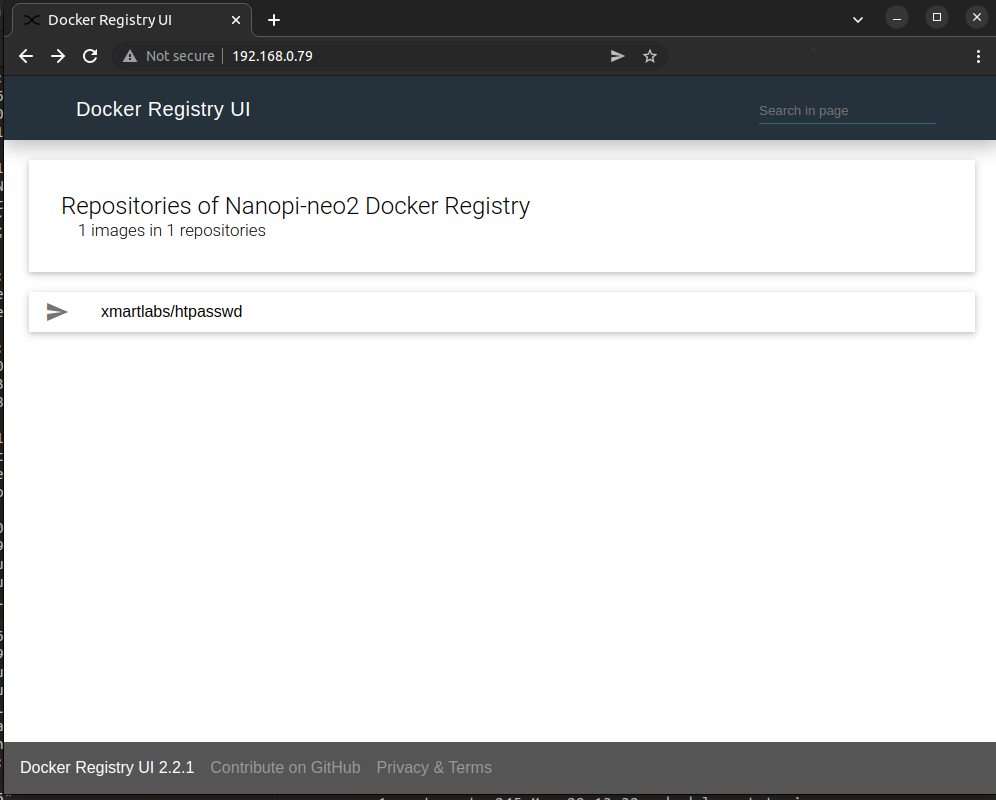

Run a docker registry on a arm64 SBC with a UI
----

In this example I'm using a [nanopi-neo2](https://wiki.friendlyelec.com/wiki/index.php/NanoPi_NEO2#:~:text=The%20NanoPi%20NEO2%20is%20a,files%20are%20ready%20for%20it.) as the registry server.


## Install armbian image to your SBC
Get the Armbian image for you SBC from [here](https://www.armbian.com/download/).
Then use [balena etcher](https://www.balena.io/etcher/) to flash it in an SD card.
Then boot and follow the steps to configure your OS for the first time.

After it's booted login and run:
```sh
sudo apt update
sudo apt upgrade
```

In my case the uname is:
```
Linux nanopineo2 5.15.26-sunxi64 #trunk.0002 SMP Thu Mar 3 10:24:53 UTC 2022 aarch64 GNU/Linux
```

## Configure armbian to run `docker`
In order to be able to run docker in your SBC you need to execute the following steps.

First edit your `armbianEnv.txt` and enable the docker optimizations:
```sh
vi /boot/armbianEnv.txt
```

Then add this line:
```sh
docker_optimizations=on
```

Reboot.

## Install docker
After you've done with the previous steps install `docker.io`

```sh
sudo apt install docker.io
sudo usermod -aG docker $USER
newgrp docker
sudo apt install apparmor
```

> Note: The apparmor is needed from docker and it's not installed by default.

Then install/get `docker-compose`:
```sh
wget https://github.com/docker/compose/releases/download/v2.5.1/docker-compose-linux-aarch64
mv docker-compose-linux-aarch64 /usr/bin/docker-compose
sudo chmod +x /usr/bin/docker-compose
```

> Note: you may need to update the version. Currently, the last version is `v2.5.1`

Get this repo
```sh
git clone https://github.com/dimtass/docker-registry-sbc.git
cd docker-registry-sbc
```

This repo is based on the [docker-registry-ui](https://github.com/Joxit/docker-registry-ui) and
I'm using the [ui-as-standalone](https://github.com/Joxit/docker-registry-ui/tree/main/examples/ui-as-standalone)
example.

## Copy your ssh keys to your SBC from your host
To simplify the process of ssh and scp files your SBC you can run this command:

```sh
ssh-copy-id -i ~/.ssh/id_rsa <sbc-user>@<sbc-ip>
```

Now you can ssh without using credentials.

## Create credentials (on your host)

Now on your host x86_64 run this to create the `htpasswd` file.

```sh
docker run --rm -ti xmartlabs/htpasswd <username> <password> htpasswd
scp htpasswd <sbc-user>@<sbc-ip>:~/docker-registry-sbc/registry-config
```

> Note: you need to replace the `<username>` and `<password>` with the credentials you want.

## Change your registry IP
You now need to change your registry IP address in the yaml files in the SBC.
First you need to change the `REGISTRY_URL` in `credentials.yml` in the root folder
with your `sbc-ip`. Then you need to change the `Access-Control-Allow-Origin:` IP
in `registry-config/credentials.yml`.

## Allow insecure registry on your host
By default docker doesn't allow http registries for security reasons. Therefore, on your
host you need to explicitly allow the unsecure registry. You can read more about that
[here](https://docs.docker.com/registry/insecure/).

On your `host` you can run this command:
```sh
docker info
```

Now verify that you see this:
```
 Insecure Registries:
  127.0.0.0/8
```

On your `host` you need to create this file:
```sh
sudo vi /etc/docker/daemon.json
```

Then add this:
```json
{ "insecure-registries":["192.168.0.79:5000"] } 
```

> Note: you need to replace the IP with your SBC's IP.

Then restart the `docker` service:
```sh
sudo service docker restart
```

And check again that the registry IP is now allowed:
```sh
docker info
```

You should now see something like this:
```sh
 Insecure Registries:
  192.168.0.79:5000
  127.0.0.0/8
```

## Run the registry server
Now on your SBC run this command inside `~/docker-registry-sbc`

```sh
sudo docker-compose -f credentials.yml up
```

If everything is fine you should see something like this:
```
[+] Running 3/3
 ⠿ Container ui-as-standalone-ui-1        Removed                                                                    0.1s
 ⠿ Container ui-as-standalone-registry-1  Removed                                                                    0.1s
 ⠿ Network ui-as-standalone_default       Removed                                                                    0.5s
dimtass@nanopineo2:~/docker-registry-ui/examples/ui-as-standalone$ 
dimtass@nanopineo2:~/docker-registry-ui/examples/ui-as-standalone$ docker-compose -f credentials.yml up
[+] Running 3/3
 ⠿ Network ui-as-standalone_default       Created                                                                    0.5s
 ⠿ Container ui-as-standalone-registry-1  Created                                                                    0.7s
 ⠿ Container ui-as-standalone-ui-1        Created                                                                    0.5s
Attaching to ui-as-standalone-registry-1, ui-as-standalone-ui-1
ui-as-standalone-registry-1  | time="2022-05-29T11:26:04.399239771Z" level=warning msg="No HTTP secret provided - generated random secret. This may cause problems with uploads if multiple registries are behind a load-balancer. To provide a shared secret, fill in http.secret in the configuration file or set the REGISTRY_HTTP_SECRET environment variable." go.version=go1.11.2 instance.id=f53bfead-3afc-4d5d-a652-6560ee54b574 service=registry version=v2.7.1 
ui-as-standalone-registry-1  | time="2022-05-29T11:26:04.399483554Z" level=info msg="Starting upload purge in 43m0s" go.version=go1.11.2 instance.id=f53bfead-3afc-4d5d-a652-6560ee54b574 service=registry version=v2.7.1 
ui-as-standalone-registry-1  | time="2022-05-29T11:26:04.399946205Z" level=info msg="redis not configured" go.version=go1.11.2 instance.id=f53bfead-3afc-4d5d-a652-6560ee54b574 service=registry version=v2.7.1 
ui-as-standalone-registry-1  | time="2022-05-29T11:26:04.471960287Z" level=info msg="using inmemory blob descriptor cache" go.version=go1.11.2 instance.id=f53bfead-3afc-4d5d-a652-6560ee54b574 service=registry version=v2.7.1 
ui-as-standalone-registry-1  | time="2022-05-29T11:26:04.473603648Z" level=info msg="Starting cached object TTL expiration scheduler..." go.version=go1.11.2 instance.id=f53bfead-3afc-4d5d-a652-6560ee54b574 service=registry version=v2.7.1 
ui-as-standalone-registry-1  | time="2022-05-29T11:26:05.493367821Z" level=info msg="Discovered token authentication URL: https://auth.docker.io/token" go.version=go1.11.2 instance.id=f53bfead-3afc-4d5d-a652-6560ee54b574 
ui-as-standalone-registry-1  | time="2022-05-29T11:26:05.49357348Z" level=info msg="Registry configured as a proxy cache to https://registry-1.docker.io" go.version=go1.11.2 instance.id=f53bfead-3afc-4d5d-a652-6560ee54b574 service=registry version=v2.7.1 
ui-as-standalone-registry-1  | time="2022-05-29T11:26:05.493651311Z" level=warning msg="Registry does not implement RempositoryRemover. Will not be able to delete repos and tags" go.version=go1.11.2 instance.id=f53bfead-3afc-4d5d-a652-6560ee54b574 service=registry version=v2.7.1 
ui-as-standalone-registry-1  | time="2022-05-29T11:26:05.494385745Z" level=info msg="listening on [::]:5000" go.version=go1.11.2 instance.id=f53bfead-3afc-4d5d-a652-6560ee54b574 service=registry version=v2.7.1 
ui-as-standalone-ui-1        | /docker-entrypoint.sh: /docker-entrypoint.d/ is not empty, will attempt to perform configuration
ui-as-standalone-ui-1        | /docker-entrypoint.sh: Looking for shell scripts in /docker-entrypoint.d/
ui-as-standalone-ui-1        | /docker-entrypoint.sh: Launching /docker-entrypoint.d/10-listen-on-ipv6-by-default.sh
ui-as-standalone-ui-1        | 10-listen-on-ipv6-by-default.sh: info: Getting the checksum of /etc/nginx/conf.d/default.conf
ui-as-standalone-ui-1        | 10-listen-on-ipv6-by-default.sh: info: /etc/nginx/conf.d/default.conf differs from the packaged version
ui-as-standalone-ui-1        | /docker-entrypoint.sh: Launching /docker-entrypoint.d/20-envsubst-on-templates.sh
ui-as-standalone-ui-1        | /docker-entrypoint.sh: Launching /docker-entrypoint.d/30-tune-worker-processes.sh
ui-as-standalone-ui-1        | /docker-entrypoint.sh: Launching /docker-entrypoint.d/90-docker-registry-ui.sh
ui-as-standalone-ui-1        | /docker-entrypoint.sh: Configuration complete; ready for start up
ui-as-standalone-ui-1        | 2022/05/29 11:26:06 [notice] 1#1: using the "epoll" event method
ui-as-standalone-ui-1        | 2022/05/29 11:26:06 [notice] 1#1: nginx/1.21.6
ui-as-standalone-ui-1        | 2022/05/29 11:26:06 [notice] 1#1: built by gcc 10.3.1 20211027 (Alpine 10.3.1_git20211027) 
ui-as-standalone-ui-1        | 2022/05/29 11:26:06 [notice] 1#1: OS: Linux 5.15.26-sunxi64
ui-as-standalone-ui-1        | 2022/05/29 11:26:06 [notice] 1#1: getrlimit(RLIMIT_NOFILE): 1048576:1048576
ui-as-standalone-ui-1        | 2022/05/29 11:26:06 [notice] 1#1: start worker processes
ui-as-standalone-ui-1        | 2022/05/29 11:26:06 [notice] 1#1: start worker process 45
ui-as-standalone-ui-1        | 2022/05/29 11:26:06 [notice] 1#1: start worker process 46
ui-as-standalone-ui-1        | 2022/05/29 11:26:06 [notice] 1#1: start worker process 47
ui-as-standalone-ui-1        | 2022/05/29 11:26:06 [notice] 1#1: start worker process 48
```

Now the service is running.

> Note: Currently the service is not running as a daemon. You need to create your own service unit to run
this service as a daemon on reboot, which is not covered here.

## Use the registry
Now on your `host` run this command:

```sh
docker login --username <user> --password <pass> <sbc-ip>:5000
```

Where:
- `<user>`, the usename that you defined in the htpasswd step above.
- `<pass>`, the password that you defined in the htpasswd step above.
- `<sbc-ip>`, the IP address of the SBC

The output should be something like this:
```
WARNING! Using --password via the CLI is insecure. Use --password-stdin.
WARNING! Your password will be stored unencrypted in /home/dimtass/.docker/config.json.
Configure a credential helper to remove this warning. See
https://docs.docker.com/engine/reference/commandline/login/#credentials-store

Login Succeeded
```

Now you're logged in.

Since the `proxy` is enabled you can use you registry to also mirror images like this:
```sh
docker pull 192.168.0.79:5000/library/nginx
```

The above command will pull the `nginx` image in your registry library and then pull it locally
on your `host`.

You can also push images like this:
```sh
docker tag xmartlabs/htpasswd 192.168.0.79:5000/xmartlabs/htpasswd
docker push 192.168.0.79:5000/xmartlabs/htpasswd
```

Then you can see the image in the ui

